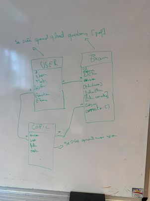

# KorreKthor <!-- omit in TOC -->

- [Database](#database)
  - [Set-up the database](#set-up-the-database)
  - [Access the database](#access-the-database)
- [Web interface](#web-interface)
  - [Install dependencies](#install-dependencies)
  - [Run Project](#run-project)
  - [Link with the database](#link-with-the-database)
    - [Updating the models table](#updating-the-models-table)
      - [With force](#with-force)
      - [With migrations](#with-migrations)
  - [How to use the app](#how-to-use-the-app)
  - [Student list format](#student-list-format)
- [Code structure](#code-structure)

## Database
### Set-up the database
The KorreKthor app runs on a docker PostgreSQL database. 

So, first thing first, you need to install docker and docker-compose. See this [link](https://docs.docker.com/get-docker/) for more informations about it.

Once docker installed, you need to run this command on a terminal in the root folder of the project (let's call it `/`):
```
docker-compose --env-file ./Interface\ web/.env -f docker-compose.yml up
```
> Note: Please consider creating a `.env` file in `/Interface web/` folder with the database informations. The `.env` file must contains :
POSTGRES_PASSWORD, 
POSTGRES_USER,
POSTGRES_DATABASE,
POSTGRES_HOST,
POSTGRES_PORT values.
>
> Note 2: The database files are stored in `/db/data/`.

To stop the database don't forget to run:
```
$ docker-compose -f docker-compose.yml down
```
### Access the database
To access the database it's recommended to install [pgAdmin4](https://www.pgadmin.org/) (a browser for PostgreSQL database). 
But, if you don't have any database browser you can use the docker PostgreSQL built-in browser named [adminer](https://www.adminer.org/) and listening on port **1880**. 

The PostgreSQL server listen on the port you specified in the `.env` file with the user and password also specified. 

## Web interface
### Install dependencies
````
$ npm install
````
### Run Project
Only if you're building the whole project, you need to apply the migations (create the different tables). To do so, run:
```
$ sequelize db:create
$ sequelize db:migrate
```
> Note: if an error occurred try `export NODE_ENV=developement` before running the above commands.

Run :
````cmd
$ node app.js
````
or, if you want to automaticly reload the server when changes :
````cmd
$ npm run start
````
### Link with the database
The project use a ORM dependency named [sequelize](https://sequelize.org/). 

Here is the database working draft :



Well, for creating a instance of a User, you just  have to insert the following lines:
```js
const { User } = require("./node_scripts/database/models");

await User.create({"fullName":"Tom DELVAUX", "matricule":"17098", "authorizations":0, "role":0})
```

Here are some example for querying the datas:

```js
var user = await User.create({"fullName":"Tom"})
var exam = await Exam.create({"name":"Exam 1", "numberOfVersion":4, "userId":user.id})
var copyA = await Copy.create({"version":"A", "userId":user.id, "examId":exam.id})
var copyB = await Copy.create({"version":"B", "userId":user.id, "examId":exam.id})

var examS = (await Exam.findAll())[0]
console.log(await examS.getUser())
console.log(await examS.getCopies())

var userS = (await User.findAll())[0]
console.log(await userS.getExams())
console.log(await userS.getCopies())

var copyS = (await Copy.findAll())[0]
console.log(await copyS.getUser())
console.log(await copyS.getExam())
```

#### Updating the models table
##### With force
When your model is updated you can just run this command to synchronize it with the database:

```
$ node node_scripts/database/migrations/migrate.js 
```
> Note: This is NOT for saving an instance in the database. This is for dropping all the tables and re-creating. All your datas will be lost !
##### With migrations
After updating your model, you juste need to update the migration file related to this model. 

Then, run:
```
$ sequelize db:migrate:undo // To undo the migration
$ sequelize db:migrate // To apply the new migration
```
> Note: if an error occurred try `export NODE_ENV=developement` before running the migation(s)

### How to use the app
First, open your favorit browser and enter this url : http://localhost:8000/.

Then, upload you student list and click **Submit file**.
> Note : this list must follow the [Student list format section](#student-list-format)

After, upload you different exam version and click **Submit all files**. 

For each version, select the correct answer(s) and click **Send**
> You can add or delete a question by clicking **Add Question** or **Remove Quesiton**
> 
> You can also click the **+** button to add an answer in a question

Wait a few seconds and your file is ready! Just click **Download**

### Student list format
The student list must contain at least 3 columns :
- *matricule* 
- *etudiant*
- *version*


Here is an example of stuent list :


## Code structure
The main file to run is in "Interface Web"/

The embedded javascript files are in "Interface web"/public/javascript/

The backend files are located in "Interface web"/node_scripts/

The .pug view files are in  "Interface web"/views/